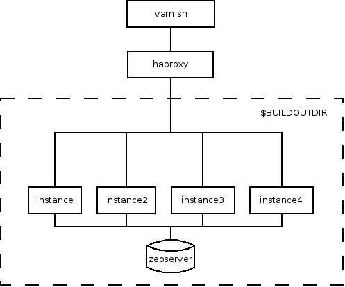

Architecture Overview
======================

Varnish
-------

Varnish is used to cache static content and some dynamic contents from Plone.
The server is configured and managed by WCC on a separate VM

HAProxy
--------

HAProxy is used to load balance requests between the 4 zope instances. HAProxy
is located in the same VM as the zope instances and the zeo server

Instances
-----------

These are the actual services that serve the Plone sites. 

ZEO Server
----------

This is the Object Database server that stores the Zope data.

